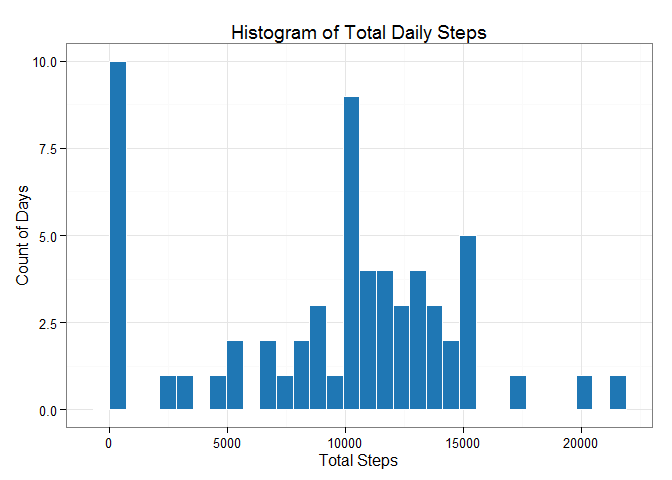
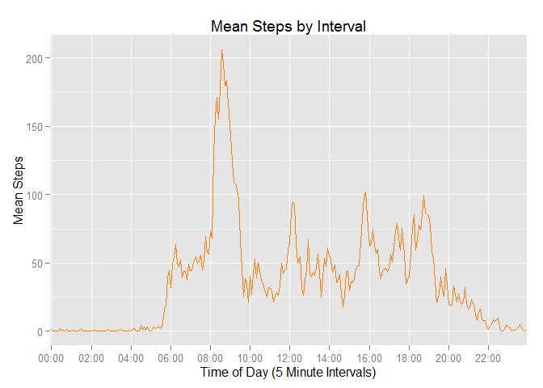
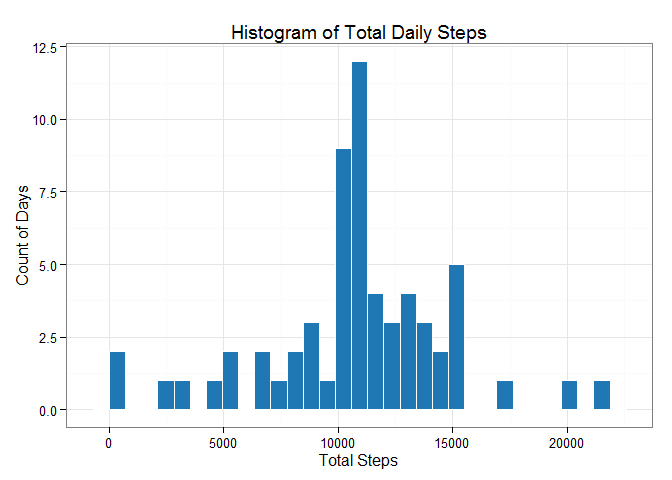
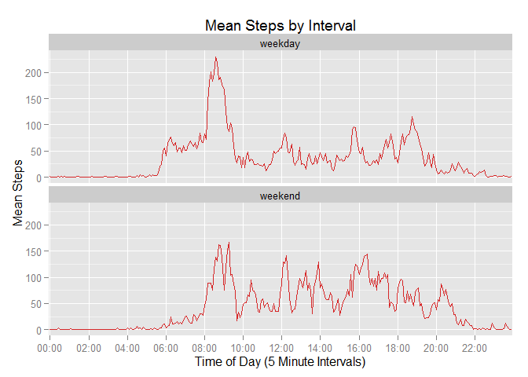

# Reproducible Research: Peer Assessment 1

## Set default options and load required libraries

```r
require(knitr) # needed for opts_chunk
require(stringr)
require(lubridate)
require(dplyr)
require(ggplot2)
require(xtable)

opts_chunk$set(echo=T)
```

## Loading and preprocessing the data

```r
# Read in the data
activities <- read.csv(unz("activity.zip", "activity.csv"))

## Add some formatting to interval
times <- str_sub(paste0("0000", activities$interval), -4)
times <- paste(str_sub(times, 1, 2),
               str_sub(times, 3, 4),
               sep=":")
activities$interval <- times

# Display the structure of the dataframe
str(activities)
```

```
## 'data.frame':	17568 obs. of  3 variables:
##  $ steps   : int  NA NA NA NA NA NA NA NA NA NA ...
##  $ date    : Factor w/ 61 levels "2012-10-01","2012-10-02",..: 1 1 1 1 1 1 1 1 1 1 ...
##  $ interval: chr  "00:00" "00:05" "00:10" "00:15" ...
```

## What is mean total number of steps taken per day?

```r
# Calculate daily total steps using dplyr
dailySteps <- activities %>%
    group_by(date) %>%
    summarize(ttl.steps=sum(steps, na.rm=T))

# Show in a histogram
ggplot(data=dailySteps, aes(ttl.steps)) +
    geom_histogram(fill=rgb(31, 119, 180, maxColorValue=255),
                   col="white") +
    labs(title="Histogram of Total Daily Steps") +
    labs(x="Total Steps", y="Count of Days") +
    theme_bw()
```

 

```r
# Calculate mean and median of total daily steps and present in a small table
meanSteps <- mean(dailySteps$ttl.steps)
medianSteps <- median(dailySteps$ttl.steps)
stepsSummary <- data.frame(cbind(meanSteps, medianSteps))
names(stepsSummary) <- c("Mean of Ttl Daily Steps",
                         "Median of Ttl Daily Steps")

print(xtable(stepsSummary), type="html", include.rownames=F)
```

<!-- html table generated in R 3.1.2 by xtable 1.7-4 package -->
<!-- Wed May 13 19:05:40 2015 -->
<table border=1>
<tr> <th> Mean of Ttl Daily Steps </th> <th> Median of Ttl Daily Steps </th>  </tr>
  <tr> <td align="right"> 9354.23 </td> <td align="right"> 10395.00 </td> </tr>
   </table>

## What is the average daily activity pattern?

```r
# Calculate the mean number of steps by interval across all days
intervalSteps <- activities %>%
    group_by(interval) %>%
    summarize(mean.steps=mean(steps, na.rm=T))

# Plot the time series data
ggplot(data=intervalSteps, aes(x=interval, y=mean.steps, group=1)) +
    geom_line(col=rgb(255, 127, 14, maxColorValue=255)) +
    labs(title="Mean Steps by Interval") +
    labs(x="Time of Day (5 Minute Intervals)", y="Mean Steps") +
    scale_x_discrete(breaks=intervalSteps$interval[seq(1, 288, 24)])
```

 

```r
# Calculate the time interval with the highest mean steps across all days.
maxInterval <- as.character(
    intervalSteps[which.max(intervalSteps$mean.steps),1])
```

<br />
The time interval with the highest mean steps across all days
is 08:35.

## Imputing missing values

```r
# Calculate the total number of missing rows
numNA <- nrow(activities[is.na(activities$steps),])
```

<br />
There are 2304 records where _activities$steps_ = `NA`.  
<br />
We will impute spme values for them so that NAs are elimated in the dataset. Given the high variability between individual segments in a given day, we'll impute values using the mean steps for that time interval across all days.  
<br />
When an entire day is missing data this means that it will be changed to mimic an average day.
<br />


```r
# Create a new dataset w/ NA's replaced w/ imputed values.
# Given the high variability between individual segments for a day, we'll
# impute using the mean steps for that time interval across all days
#
# This also avoids the issue of whole days w/ only steps = NA
imputed <- activities
imputed <- imputed %>%
    group_by(interval) %>%
    mutate(steps=ifelse(is.na(steps), mean(steps, na.rm=T), steps))

# Calculate daily total steps using dplyr
dailyImputed <- imputed %>%
    group_by(date) %>%
    summarize(ttl.steps=sum(steps, na.rm=T))

# Show in a histogram
ggplot(data=dailyImputed, aes(ttl.steps)) +
    geom_histogram(fill=rgb(31, 119, 180, maxColorValue=255),
                   col="white") +
    labs(title="Histogram of Total Daily Steps") +
    labs(x="Total Steps", y="Count of Days") +
    theme_bw()
```

 

```r
# Calculate mean and median of total daily steps and present in a small table
meanSteps <- mean(dailyImputed$ttl.steps)
medianSteps <- median(dailyImputed$ttl.steps)
stepsSummary <- data.frame(cbind(meanSteps, medianSteps))
names(stepsSummary) <- c("Mean of Ttl Daily Steps",
                         "Median of Ttl Daily Steps")

print(xtable(stepsSummary), type="html", include.rownames=F)
```

<!-- html table generated in R 3.1.2 by xtable 1.7-4 package -->
<!-- Wed May 13 19:05:41 2015 -->
<table border=1>
<tr> <th> Mean of Ttl Daily Steps </th> <th> Median of Ttl Daily Steps </th>  </tr>
  <tr> <td align="right"> 10766.19 </td> <td align="right"> 10766.19 </td> </tr>
   </table>
<br />
Imputing values for the NA's by using the average steps for each interval across all days has some flaws, notibly that the mean rises to be equal to the median. This is because many of the NA records are the result of having no data for an entire day. A more sophisticated approach may require fewer trade-offs.

## Are there differences in activity patterns between weekdays and weekends?

```r
# Add weekpart variable to distinguish weekend & weekday observations
weekpart <- as.character(wday(imputed$date, label=T))
weekpart[weekpart %in% c("Sat", "Sun")] <- "weekend"
weekpart[!weekpart == "weekend"] <- "weekday"
imputed$weekpart <- as.factor(weekpart)

# Calculate the mean number of steps by interval across all days/weekparts
weekpartSteps <- imputed %>%
    group_by(interval, weekpart) %>%
    summarize(mean.steps=mean(steps, na.rm=T))

# Plot the time series data in two facets
ggplot(data=weekpartSteps, aes(x=interval, y=mean.steps, group=1)) +
    geom_line(col=rgb(214, 39, 40, maxColorValue=255)) +
    labs(title="Mean Steps by Interval") +
    labs(x="Time of Day (5 Minute Intervals)", y="Mean Steps") +
    scale_x_discrete(breaks=weekpartSteps$interval[seq(1, 576, 48)]) +
    facet_wrap(~ weekpart, ncol=1)
```

 
